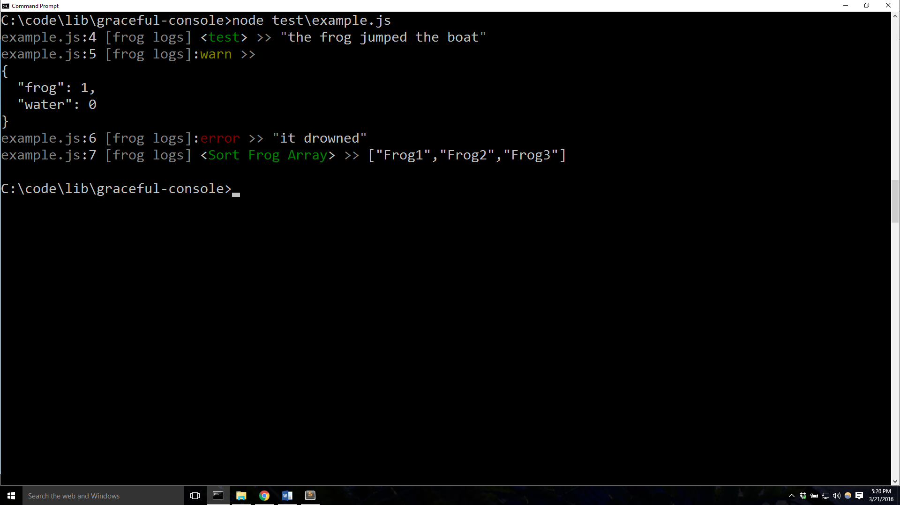

# scribe


## Synopsis

Decorator console module that adds color, formatting, sorting, etc.. to the node console. 

## Code Example

The new console gives you more control. More colors. Line Numbers. Sorting. Etc... Contribute!

```javascript
// Set a global variable called scribe
global.scribe = require('scribe');

// Use the global instance to log
scribe.tag('test').log('the frog jumped the boat');
scribe.warn({frog:1, water: 0});
scribe.error('it drowned');
scribe.tag('Sort Frog Array').sort(true).log(['Frog1', 'Frog3', 'Frog2']);
```

Drum role please...


## Get Started

Use NPM to install 	`npm install scribe --save`

Last step:

```javascript
global.scribe = require('scribe');
```

## API Reference

###scribe.settings(obj), scribe.options(obj)

Settings sets these options till they are unset. Options sets these options for the immediate next log, info, warn, error, critical, etc.

`opts` Choose the scribe options: write path, stack, time, and/or lvl. 

+ `write` path dictates where scribe should output a scribe log file too.
+ `isStack` dictates weather or not to show line numbers and file names. **This is resource intensive. Dont enable in production.**
+ `isTime` dictates weather or not to show a time stamp.
+ `maxLvl` dictates how much information you want scribe to print: do you want to print all scribe messages or just errors? (`scribe.ERROR || scribe.CRITICAL << scribe.WARN << scribe.ALL || scribe.INFO`)
+ `label` **For advanced users!** Instead use the alias scribe#warn, scribe#error, scribe#info, and scribe#critical.
+ `lvl` **For advanced users!** Instead use the alias scribe#warn, scribe#error, scribe#info, and scribe#critical.
+ `sort` **Do not use!** Instead use the alias scribe#sort.
+ `tag` **Do not use!** Instead use the alias scribe#tag.

###scribe.log(str), scribe.error(str), scribe.info(str), scribe.warn(str), scribe.critical(str)

Takes a string `str` as the output tag. Prints `str`  to stdout with newline. Eats the current options such as tag and sort.

```javascript
scribe.log('I have a frog.');
scribe.info('He is there.');
scribe.warn('The frog might jump the boat.');
scribe.error('The frog jumped the boat.');
scribe.critical('The frog did not die.');
```

###scribe.tag(str)

Takes a string `str` as the output tag. The next log, error, warn, info will be tagged with the `str`.

```javascript
scribe.tag('test').log('the frog jumped the boat');
```

###scribe.sort(arg)

Takes a function or a boolean `arg`. The next log, error, warn, info will be sorted.

```javascript
scribe.tag('Sort Test Array').sort().log([1, 3, 2]);
scribe.tag('Sort Test Object').sort().log({1: 'a', 3: 'c', 2: 'b'});
scribe.tag('Sort Test Function Inveser').sort(function(a, b) { return b.value.charCodeAt(0) - a.value.charCodeAt(0)}).log({1: 'a', 3: 'c', 2: 	'b'});
```
###scribe.break(str)

Prints a new line.

```javascript
scribe.break();
```

###scribe.chunk(func)

Takes a function `func` where every call to scribe chunks text using spacing and pretty formatting.

```javascript
scribe.tag('chunk').chunk(() => {
	scribe.log(true);
	scribe.log(false);
	scribe.tag('string').log('A string');
	scribe.tag('printf').log('A manipulated string (%s) with number: %d', 'apple', 42);
	scribe.tag('number').log(1);
	scribe.log(1);
	scribe.log(true);
	scribe.log({me:1});
	scribe.log([1,2,3]);
	scribe.error([1,2,3]);
	scribe.error('');
	scribe.error(new Error("Errorrrs"));
	scribe.tag('Sort Test Array').sort().log([1, 3, 2]);
	scribe.tag('Sort Test Object').sort().log({1: 'a', 3: 'c', 2: 'b'});
	scribe.tag('Sort Test Function Inveser').sort(function(a, b) { return b.value.charCodeAt(0) - a.value.charCodeAt(0) }).log({1: 'a', 3: 'c', 2: 'b'});
});
```

###scribe.dir, scribe.assert, scribe.time, scribe.timeEnd

Alias to the console equivalent (i.e. console.dir, console.assert, etc).
Refer to Node documentation for behavior https://nodejs.org/api/scribe.html#scribe_scribe_log_data

## TODO
+ Update scribe to take into account toString when printing javascript objects
+ Add changelog to readme

## License

MIT